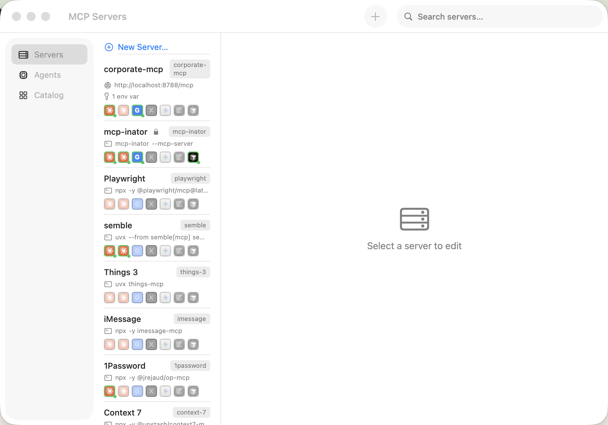
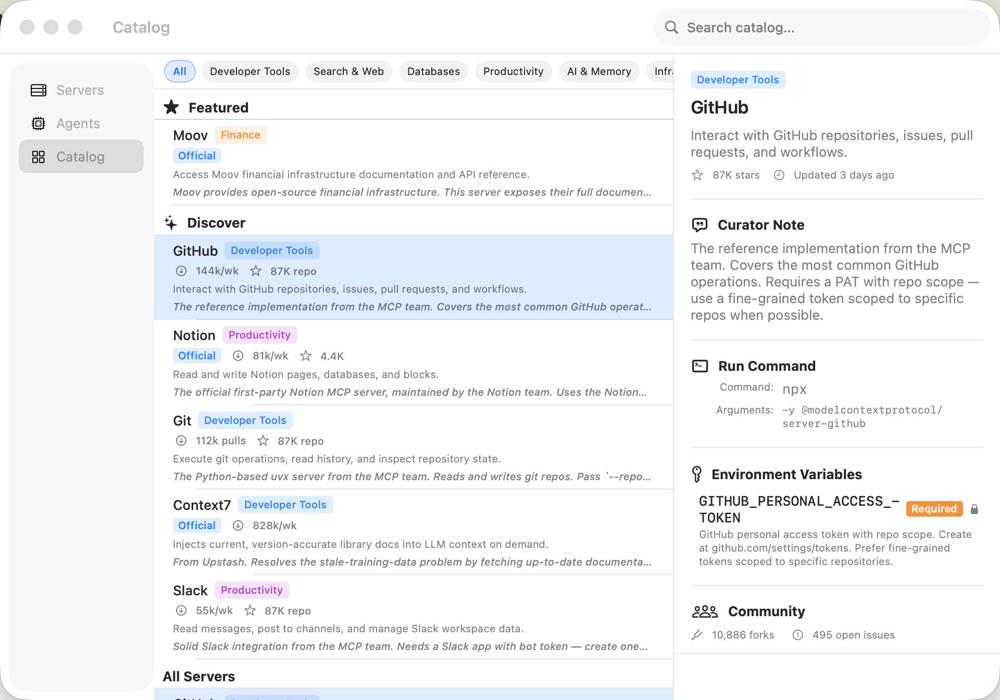

# mcp-inator

<p align="center">
  
</p>

**Configure an MCP server once — mcp-inator writes it to every AI agent you use.**

mcp-inator is a macOS app that manages your [Model Context Protocol](https://modelcontextprotocol.io/) server configurations across Claude Code, Claude Desktop, Gemini CLI, Codex CLI, Cursor, Zed, and more. Add a server once and it appears in all your tools automatically.

## Installation

### One-line install

```bash
curl -fsSL https://rayjohnson.github.io/mcp-inator/install.sh | bash
```

Downloads the latest release, installs it to `/Applications`, and clears the Gatekeeper quarantine flag automatically.

### Manual install

1. Download the latest `mcp-inator-X.Y.Z.dmg` from [GitHub Releases](https://github.com/rayjohnson/mcp-inator/releases)
2. Open the DMG and drag **mcp-inator** to your Applications folder
3. On first launch, macOS will block the app — right-click → **Open** to bypass, or run:
   ```bash
   xattr -dr com.apple.quarantine /Applications/mcp-inator.app
   ```

### Uninstall

```bash
curl -fsSL https://rayjohnson.github.io/mcp-inator/uninstall.sh | bash
```

Removes the app and its data. Your agent config files are not touched.

### Updates

Once installed, mcp-inator updates itself automatically via the built-in updater.

## Quick Start

1. **Launch mcp-inator** — it appears as a menu bar icon (or in the Dock if you prefer).
2. **Add a server** — click **New Server…**, enter a name, command, and any arguments or environment variables, then save.
3. **Apply to agents** — mcp-inator writes the config to every enabled agent immediately. Open Claude, Gemini, or Cursor and the server is already there.

That's it. Add more servers the same way; they all stay in sync automatically.

## Features

### Server Management

Add, edit, and remove MCP servers from a single list. Each server can be enabled or disabled per-agent independently — the config is preserved even when disabled. Mark a server **Private** to exclude it from usage reports entirely.

### Catalog

<p align="center">
  
</p>

Browse a curated list of popular MCP servers with pre-filled defaults. Tap any entry to see its description, required environment variables, and community usage stats, then tap **Add to Library** to install it in one step. The catalog is fetched from GitHub and cached locally — it works offline after the first load. Teams can also add internal servers via [private catalogs](docs/private-catalogs.md).

### Agent Support Matrix

mcp-inator writes configs for all major AI agents, including:

| Agent | Config location |
|-------|----------------|
| Claude Code | `~/.claude/claude_desktop_config.json` |
| Claude Desktop | `~/Library/Application Support/Claude/claude_desktop_config.json` |
| Gemini CLI | `~/.gemini/settings.json` |
| Codex CLI | `~/.codex/config.yaml` |
| Cursor | `~/.cursor/mcp.json` |
| Zed | `~/.config/zed/settings.json` |

The Agents tab shows which agents are detected on your machine.

### Usage Sharing (opt-in)

After 7 days of use, mcp-inator offers to share anonymous data about which servers you use. This helps surface popular servers in the catalog. You can review exactly what would be sent before submitting, and withdraw at any time from **Preferences → Contributing Usage Data**.

## Privacy

Usage sharing is **opt-in and off by default**. When enabled, mcp-inator sends server key names (e.g. `filesystem`), command basenames (e.g. `npx`), argument structure with filesystem paths replaced by `<path>`, and environment variable key names only — never their values. Private servers and any server you excluded on the review screen are never included. No personally identifiable information is ever sent.

## Requirements

- macOS 13.0 or later

## License

Copyright © 2026 Ray Johnson. All rights reserved.
